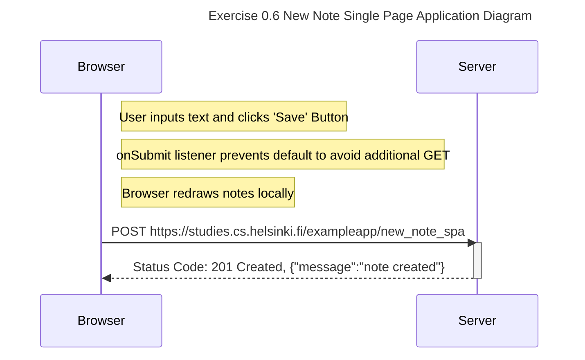

```mermaid

sequenceDiagram

    title: Exercise 0.6 New Note Single Page Application Diagram
    participant Browser
    participant Server

    note right of Browser: User inputs text and clicks 'Save' Button

    note right of Browser: onSubmit listener prevents default to avoid additional GET 

    note right of Browser: Browser redraws notes locally  

    Browser->> Server: POST https://studies.cs.helsinki.fi/exampleapp/new_note_spa
    activate Server
    Server-->>Browser: Status Code: 201 Created, {"message":"note created"}
    deactivate Server

```