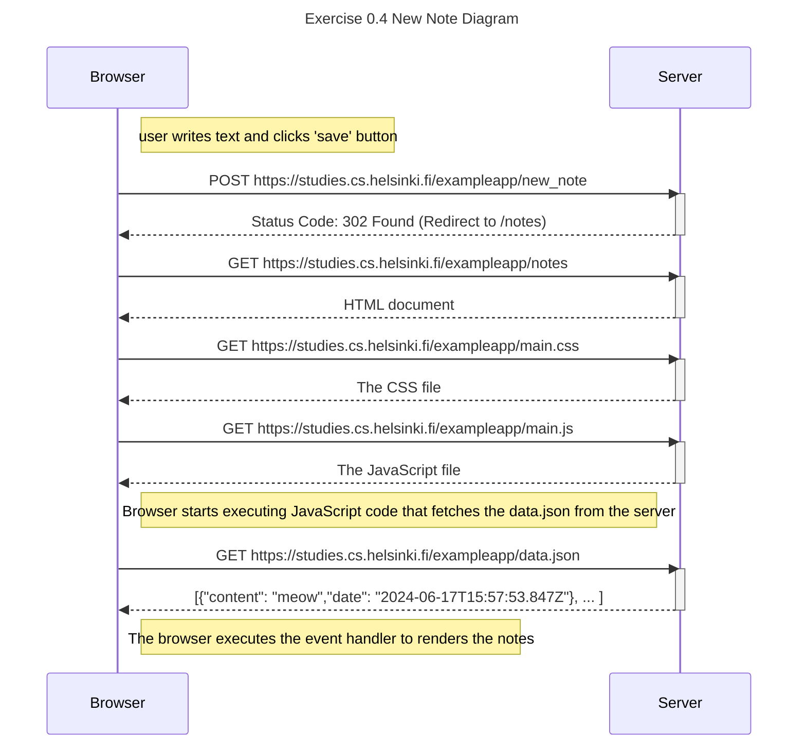

```mermaid

sequenceDiagram
    title: Exercise 0.4 New Note Diagram 
    participant Browser
    participant Server

    note right of Browser: user writes text and clicks 'save' button
 

    Browser->>Server: POST https://studies.cs.helsinki.fi/exampleapp/new_note
    activate Server
    Server-->>Browser: Status Code: 302 Found (Redirect to /notes)
    deactivate Server

    Browser->> Server: GET https://studies.cs.helsinki.fi/exampleapp/notes
    activate Server
    Server-->>Browser: HTML document
    deactivate Server

    Browser->>Server: GET https://studies.cs.helsinki.fi/exampleapp/main.css
    activate Server
    Server-->>Browser: The CSS file
    deactivate Server

    Browser->>Server: GET https://studies.cs.helsinki.fi/exampleapp/main.js
    activate Server
    Server-->>Browser: The JavaScript file
    deactivate Server

    note right of Browser: Browser starts executing JavaScript code that fetches the data.json from the server

    Browser->>Server: GET https://studies.cs.helsinki.fi/exampleapp/data.json
    activate Server
    Server-->>Browser: [{"content": "meow","date": "2024-06-17T15:57:53.847Z"}, ... ]
    deactivate Server

    Note right of Browser: The browser executes the event handler to renders the notes
```