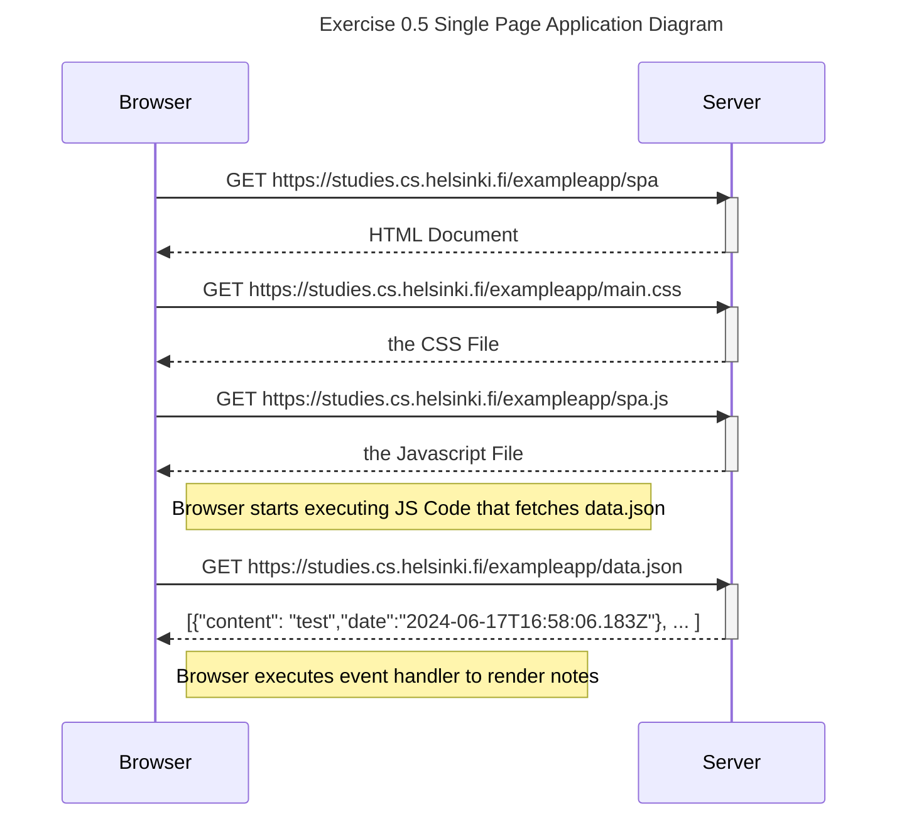

```mermaid
sequenceDiagram
    title: Exercise 0.5 Single Page Application Diagram
    participant Browser
    participant Server

Browser ->> Server: GET https://studies.cs.helsinki.fi/exampleapp/spa
activate Server
Server -->> Browser: HTML Document
deactivate Server

Browser ->> Server: GET https://studies.cs.helsinki.fi/exampleapp/main.css
activate Server
Server -->> Browser: the CSS File
deactivate Server

Browser ->> Server: GET https://studies.cs.helsinki.fi/exampleapp/spa.js
activate Server
Server -->> Browser: the Javascript File
deactivate Server

note right of Browser: Browser starts executing JS Code that fetches data.json

Browser->>Server: GET https://studies.cs.helsinki.fi/exampleapp/data.json
activate Server
Server-->>Browser: [{"content": "test","date":"2024-06-17T16:58:06.183Z"}, ... ]
deactivate Server

note right of Browser: Browser executes event handler to render notes

```